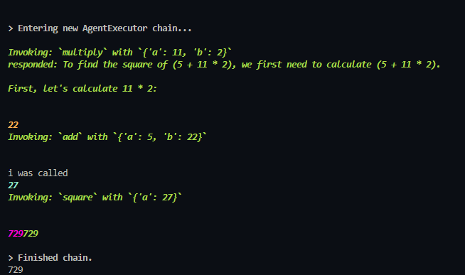

# Math Agent using LangChain

This project demonstrates a simple math agent using LangChain. The agent can perform basic mathematical operations such as addition, multiplication, and squaring a number.

## Installation Guide

To get started with this project, follow these steps:

1. **Clone the repository**:
   ```bash
   git clone https://github.com/theabdulraffay/Simple-Math-Agent.git
   cd 'Simple Math Agent'
   ```

2. **Set up a virtual environment** (optional but recommended):
   ```bash
   python -m venv venv
   source venv/bin/activate  # On Windows use `venv\Scripts\activate`
   ```

3. **Install the required dependencies**:
   ```bash
   pip install langchain langchain-groq python-dotenv
   ```

4. **Create a `.env` file** in the root directory of the project and add your environment variables:
   ```env
   GROQ_API_KEY=your_groq_api_key
   ```

5. **Run the script**:
   ```bash
   python agent.py
   ```

## Code Explanation

The code sets up a simple math agent using LangChain. Here's a brief overview of the main components:

<!-- - **Imports**:
  ```python
  from langchain_core.tools import tool
  from langchain_groq import ChatGroq
  from dotenv import load_dotenv
  from langchain_core.prompts import ChatPromptTemplate, MessagesPlaceholder
  from langchain.agents import AgentExecutor, create_tool_calling_agent, create_openai_tools_agent
  load_dotenv()
  ``` -->

- **Tools**: The agent uses three tools for mathematical operations:
  <!-- - `add(a: int, b: int) -> int`: Adds two numbers.
  - `multiply(a: int, b: int) -> int`: Multiplies two numbers.
  - `square(a: int) -> int`: Squares a number. -->

- **Model**: The `ChatGroq` model is used with specific parameters:
  <!-- ```python
  model = ChatGroq(
      model="meta-llama/llama-4-maverick-17b-128e-instruct",
      temperature=0,
      max_tokens=None,
      timeout=None,
      max_retries=2,
  )
  ``` -->

- **Prompt**: A `ChatPromptTemplate` is used to define the interaction with the agent:
  <!-- ```python
  prompt = ChatPromptTemplate.from_messages(
      [
          ("system", "You are a mathematical assistant. Use your tools to answer questions..."),
          MessagesPlaceholder("chat_history", optional=True),
          ("human", "{input}"),
          MessagesPlaceholder("agent_scratchpad"),
      ]
  )
  ``` -->

- **Agent**: The agent is created and executed:
  <!-- ```python
  agent = create_tool_calling_agent(llm=model, tools=tools, prompt=prompt)
  agent_executor = AgentExecutor(agent=agent, tools=tools, verbose=True)
  result = agent_executor.invoke({
      "input": "What is the square of (5 + 11 * 2)?",
  })
  print(result['output'])
  ``` -->

## Output Screenshot

